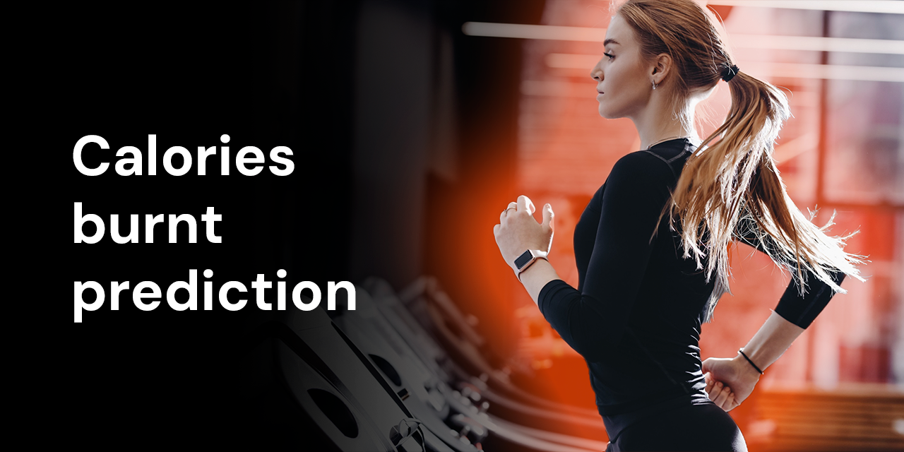

# Calories burnt prediction.

With this app you will be able to estimate how many calories you would burn during a workout. The model accepts parameters such as age, gender, workout duration, height, weight, body temperature and heart rate. The model then estimates the number of calories you could burn.

# Model training
### burn_calories_model.ipynb
In this project, several machine learning algorithms, such as linear regression and gradient boosting, were trained and analyzed.

**Stack:** pandas, numpy, matplotlib, optuna, sklearn, lightgbm, catboost

**MAE:** 1.9793129448504605

# Telegram bot
In progress

